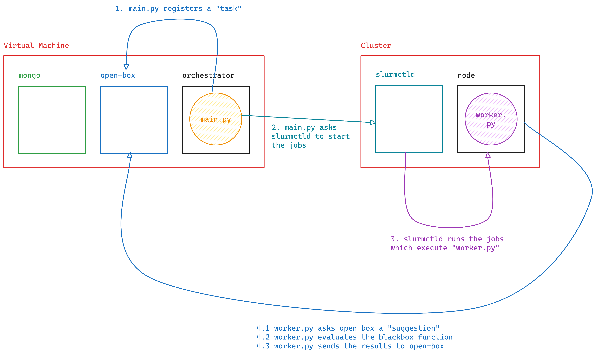

= How does this sutff work?

I'll be quick, I'll improve the documentation later

```bash
git clone https://github.com/CuriousCI/optimization-buck-passing
cd optimization-buck-passing
docker compose up
```

Next open `localhost:8000` in your browser, and register with email `test@test.test` 
and password `testtest`, then login to see the job

```bash
# In terminal 1
docker exec -it optimization-buck-passing-slurmctld-1 /bin/bash
cd /data
uv sync
```

```bash
# In terminal 2
docker exec -it optimization-buck-passing-orchestrator-1 /bin/bash
cd /app
uv sync
uv run main.py
```

Now the jobs will start!

== On an architecture point of view


